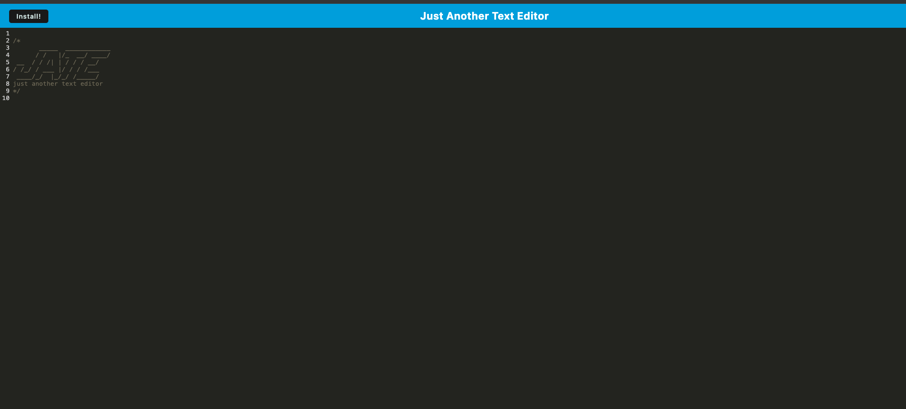

# Just Another Text Editor

  

  ## Description
  As a developer I want to build a progressive web app which allows a user to enter and edit text. The editor will be available in both the browser and as a downloadable program.
  
  ## Table of Contents
  1. [Installation](#Installation)
  2. [Usage](#usage)
  3. [License](#license)
  4. [Contribute](#contribute)
  5. [Tests](#tests)
  6. [Questions](#questions)
  
  ## Installation
  Installation is not necessary. Simply visit the applications site: https://bk-jate-pwa-27e7f653ac17.herokuapp.com and the editor is ready to run.
  
  ## Usage
  The editor is a very simple program. Click into the editor and start typing. Entries will be cached as well as stored in a local database. To download the standalone application, either click the install button on the editor itself, or click the download icon in the URL bar.

  
  
  ## License
  This software is not covered under any license.
  
  
  
  ## How to Contribute
  N/A
  
  ## Tests
  N/A
  
  ## Questions
  Github: https://github.com/bklein1981
  
  email: You may contact me at  if you have additional questions.
